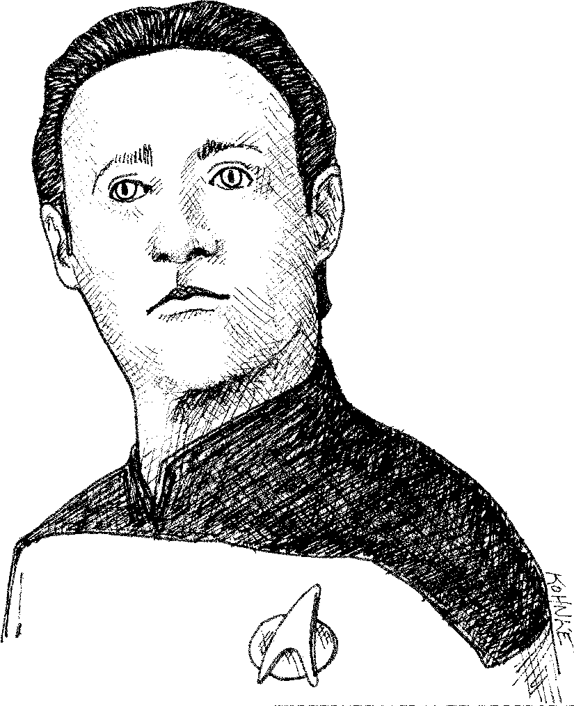

# ۶ اشیاء و ساختمان داده ها



<div dir="rtl">

یک دلیل وجود دارد که ما متغیرهایمان را خصوصی نگه می داریم. ما نمی خواهیم شخص دیگری به آنها وابسته شود
ما می خواهیم آزادی تغییر نوع یا اجرای آنها را مطابق میل و انگیزه حفظ کنیم.
بنابراین ، چرا بسیاری از برنامه نویسان به طور خودکار گیرنده ها و تنظیم کننده ها (getters, setters) را به اشیا خود اضافه می کنند و متغیرهای خصوصی خود را در معرض دید عمومی قرار می دهند؟

## مجزاسازی داده ها

تفاوت بین لیست 6-1 و لیست 6-2 را در نظر بگیرید. هر دو داده های یک نقطه را در صفحه دکارتی نشان می دهند. و اما یکی اجرای آن را برملا می کند و دیگری کاملاً آن را پنهان می کند.
</div>

Listing 6-1

Concrete Point
```java
public class Point {
    public double x;
    public double y;
}
```

Listing 6-2

Concrete Point
```java
public interface Point {
    double getX();
    double getY();
    void setCartesian(double x, double y);
    double getR();
    double getTheta();
    void setPolar(double r, double theta);
}
```
<div dir='rtl'>

نکته جالب در مورد لیست 6-2 این است که به هیچ وجه نمی توانید تشخیص دهید که این اجرا در مختصات مستطیل است یا قطب. ممکن است هیچ کدام نباشد! و با این وجود رابط کاربری هنوز هم به طرز غیرقابل تردیدی یک ساختار داده را نشان می دهد.

اما این چیزی فراتر از یک ساختار داده است. این روش ها سیاست دسترسی را اجرا می کنند. مختصات منفرد را می توانید به طور مستقل بخوانید ، اما باید مختصات را به عنوان یک عمل اتمی کنار هم قرار دهید.

از طرف دیگر ، لیست 6-1 به وضوح در مختصات مستطیل اجرا می شود و ما را مجبور می کند تا مختصات را به طور مستقل دستکاری کنیم. این امر پیاده سازی را آشکار می کند. در واقع ، حتی اگر متغیرها خصوصی باشند و ما از گیرنده ها و تنظیم کننده های یک متغیره استفاده کنیم ، این امر پیاده سازی را نشان می دهد.

پنهان کردن پیاده سازی فقط قرار دادن لایه ای از توابع بین متغیرها نیست. پنهان کردن اجرا در مورد انتزاع است! یک کلاس متغیرهای خود را به راحتی از طریق گیرنده ها و تنظیم کننده ها بیرون نمی کشد. بلکه رابط های انتزاعی را در اختیار شما قرار می دهد که به کاربران آن اجازه می دهد ماهیت داده ها را دستکاری کنند ، بدون اینکه نیازی به دانستن نحوه اجرای آن داشته باشند.

لیست 6-3 و لیست 6-4 را در نظر بگیرید. اولی از اصطلاحات انضمامی برای برقراری ارتباط با سطح سوخت یک وسیله نقلیه استفاده می کند ، در حالی که مورد دوم با برداشت درصد انجام می شود. در مورد انضمامی می توانید کاملاً مطمئن باشید که اینها فقط متغیرهای دسترسی هستند. در حالت انتزاعی ، شما هیچ سرنخی درباره شکل داده ها ندارید.

</div>

Listing 6-3

Concrete Vehicle
```java
public interface Vehicle {
    double getFuelTankCapacityInGallons();
    double getGallonsOfGasoline();
}
```

Listing 6-4

Abstract Vehicle
```java
public interface Vehicle {
    double getPercentFuelRemaining();
}
```
<div dir='rtl'>

در هر دو مورد بالا گزینه دوم ارجح است. ما نمی خواهیم جزئیات داده های خود را فاش کنیم. بلکه می خواهیم داده های خود را به صورت انتزاعی بیان کنیم. این فقط با استفاده از رابط ها و/یا گیرنده ها و تنظیم کننده ها محقق نمی شود. برای نشان دادن داده های موجود در یک شی ، باید به فکر جدی پرداخت. بدترین گزینه این است که بی باکانه جمع کننده ها و تنظیم کننده ها را اضافه کنید.

## نا متناقض بودن داده/شیء

این دو مثال تفاوت بین اشیا and و ساختارهای داده را نشان می دهد. اشیا داده های خود را در پشت انتزاع پنهان می کنند و عملکردهایی را که بر روی این داده ها کار می کنند ، نشان می دهند. ساختار داده ها داده های آنها را نشان می دهد و هیچ عملکرد معنی داری ندارند. برگردید و دوباره آن را بخوانید. به ماهیت تعریف شده این دو تعریف توجه کنید. آنها مجازاً مخالف هستند. این تفاوت ممکن است پیش پا افتاده به نظر برسد ، اما پیامدهای فراتر از آن دارد.

به عنوان مثال ، مثال `Shape` رویه ای را در لیست 6-5 در نظر بگیرید. کلاس `Geometry` در سه کلاس `Shape` عمل می کند. کلاسهای `Shape` یک ساختار داده ای ساده و بدون هیچ گونه رفتاری هستند. تمام رفتارها در کلاس `Geometry` است.

</div>

Listing 6-5

Procedural Shape
```java
public class Square {
    public Point topLeft;
    public double side;
}

public class Rectangle {
    public Point topLeft;
    public double height;
    public double width;
}

public class Circle {
    public Point center;
    public double radius;
}

public class Geometry {
    public final double PI = 3.141592653589793;

    public double area(Object shape) throws NoSuchShapeException
    {
        if (shape instanceof Square) {
            Square s = (Square)shape;
            return s.side * s.side;
        }
        else if (shape instanceof Rectangle) {
            Rectangle r = (Rectangle)shape;
            return r.height * r.width;
        }
        else if (shape instanceof Circle) {
            Circle c = (Circle)shape;
            return PI * c.radius * c.radius;
        }
        throw new NoSuchShapeException();
    }
}
```
<div dir='rtl'>

برنامه نویسان شی گرا ممکن است از این رو بینی خود را چروکیده و از رویه بودن آن شکایت کنند - و آنها درست می گویند. اما ممکن است تمسخر موجه نباشد. در نظر بگیرید که اگر یک تابع `perimeter()` به `Geometry` اضافه شود چه اتفاقی می افتد. کلاسهای `Shape` بی تأثیر خواهد بود! هر کلاس دیگری که به شکل ها بستگی داشته باشد نیز تحت تأثیر قرار نمی گیرد! از طرف دیگر ، اگر شکل جدیدی اضافه کنم ، برای مقابله با آن باید تمام توابع موجود در `Geometry` را تغییر دهم. باز هم ، آن را بخوانید توجه داشته باشید که این دو شرط کاملاً مخالف هستند.

اکنون راه حل شی گرا را در لیست 6-6 در نظر بگیرید. در اینجا روش `area()` چند شکل است. هیچ کلاس `Geometry` لازم نیست. بنابراین اگر یک شکل جدید اضافه کنم ، هیچ یک از توابع موجود تحت تأثیر قرار نمی گیرند ، اما اگر یک تابع جدید اضافه کنم ، همه اشکال باید تغییر کنند!

</div>

Listing 6-6

Polymorphic Shapes
```java
public class Square implements Shape {
    private Point topLeft;
    private double side;

    public double area() {
        return side*side;
    }
}

public class Rectangle implements Shape {
    private Point topLeft;
    private double height;
    private double width;

    public double area() {
        return height * width;
    }
}

public class Circle implements Shape {
    private Point center;
    private double radius;
    public final double PI = 3.141592653589793;
    
    public double area() {
        return PI * radius * radius;
    }
}
```

<div dir='rtl'>

باز هم ، ماهیت تعارفی این دو تعریف را می بینیم. آنها مجازاً مخالف هستند! این دوگانگی اساسی بین اشیا و ساختارهای داده را آشکار می کند:

    *کد رویه ای (کد با استفاده از ساختارهای داده) افزودن توابع جدید را بدون تغییر در ساختار داده های موجود آسان می کند. از طرف دیگر ، کد OO افزودن کلاسهای جدید را بدون تغییر توابع موجود آسان می کند.*

مکمل آن نیز درست است:

    *کد رویه ای افزودن ساختارهای داده جدید را دشوار می کند زیرا همه عملکردها باید تغییر کنند. کد OO افزودن توابع جدید را دشوار می کند زیرا همه کلاسها باید تغییر کنند.*

بنابراین ، مواردی که برای OO سخت است برای رویه ای آسان است ، و مواردی که برای رویه ای سخت است برای OO آسان است!

در هر سیستم پیچیده ای زمان هایی پیش می آید که ما می خواهیم انواع داده های جدید را به جای توابع جدید اضافه کنیم. برای این موارد اشیا و OO مناسب ترین هستند. از طرف دیگر ، زمانهایی نیز وجود خواهد داشت که ما می خواهیم توابع جدیدی را در مقابل انواع داده اضافه کنیم. در این صورت کد رویه ای و ساختار داده ها مناسب تر خواهند بود.

برنامه نویسان بالغ می دانند که این ایده که همه چیز یک شی است افسانه است. گاهی اوقات شما واقعاً می خواهید ساختارهای داده ساده ای داشته باشید که روی آنها کار کند.
</div>